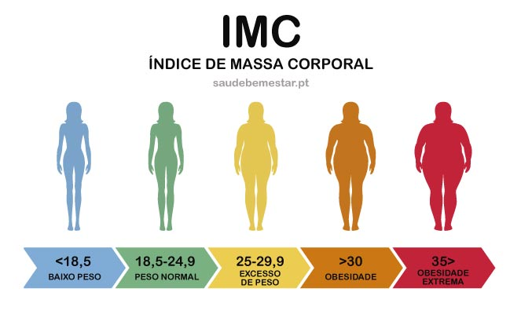

# IMC-Calculator in Python

O IMC, ou Índice de Massa Corporal, é uma medida que utiliza a altura e o peso de uma pessoa para avaliar se ela está dentro de faixas consideradas saudáveis em termos de peso corporal. A fórmula para calcular o IMC é a seguinte:

O resultado do cálculo do IMC é então comparado com faixas de valores predefinidas pela Organização Mundial da Saúde (OMS) e outras instituições de saúde, que classificam o peso em categorias como subpeso, peso normal, sobrepeso e obesidade, indicando se uma pessoa está dentro de um peso considerado saudável ou se está em risco de problemas de saúde associados ao peso.

Saber o IMC é importante porque oferece uma maneira rápida e fácil de avaliar se uma pessoa está em um peso saudável para sua altura. Ter um peso fora da faixa considerada saudável pode estar associado a uma série de problemas de saúde, como diabetes, doenças cardíacas, pressão alta, entre outros. Portanto, monitorar o IMC regularmente pode ajudar na prevenção e no gerenciamento desses problemas de saúde, incentivando a adoção de hábitos de vida mais saudáveis, como uma alimentação equilibrada e a prática regular de exercícios físicos.